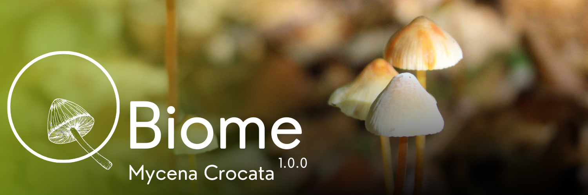

## 🌿&#xFE0F Une application dédiée aux données naturalistes
QBiome est une application **gratuite et open-source** permettant la saisie et la gestion des données naturalistes. Conçue pour s’intégrer parfaitement à QGIS et QField, elle offre une solution clé en main pour les chercheurs, écologues et passionnés de biodiversité.

### QBiome 1.0.0 Mycena crocata 🍄‍🟫&#xFE0F
Cette toute première version propose une gestion de projet complète, intégrant la faune, la flore et la fonge en un seul outil. 
- Protocoles d'observation et d'écoute pour la faune
- Relevés phytosociologiques par strate
- Cartographie d'habitats
- Recensement et gestion des zones humides
- Cartographie des sondages pédologies horizon par horizon
- TaxRef 18
- Statuts de menace et de protection régionalisés
- Export des données au format SINP

<a href="lien_vers_ton_fichier.zip" style="
  display: inline-block;
  padding: 10px 20px;
  background-color: #839e17;
  color: white;
  text-decoration: none;
  border-radius: 5px;
  font-weight: bold;">
  Télécharger QBiome 1.0.0 Mycena crocata
</a>

## Versions spécifiques

Si QBiome permet la gestion complète d'un projet, certain préfèreront des version plus légères, centrées sur leur coeur d'activité :

<a href="lien_vers_ton_fichier.zip" style="
  display: inline-block;
  padding: 10px 20px;
  background-color: #839e17;
  color: white;
  text-decoration: none;
  border-radius: 5px;
  font-weight: bold;">
  QBiome 1.0.0 Mycena crocata - Version Faune 🦗&#xFE0F
</a>

<a href="lien_vers_ton_fichier.zip" style="
  display: inline-block;
  padding: 10px 20px;
  background-color: #839e17;
  color: white;
  text-decoration: none;
  border-radius: 5px;
  font-weight: bold;">
  QBiome 1.0.0 Mycena crocata - Version Flore 🌱&#xFE0F
</a>

<a href="lien_vers_ton_fichier.zip" style="
  display: inline-block;
  padding: 10px 20px;
  background-color: #839e17;
  color: white;
  text-decoration: none;
  border-radius: 5px;
  font-weight: bold;">
  QBiome 1.0.0 Mycena crocata - Version Fonge 🍄&#xFE0F
</a>

## Participez à l'aventure QBiome

QBiome est un projet vivant, destiné à s'améliorer au fil du temps. Si vous avez des questions, des remarques, ou simplement envie d'échanger autour de l'utilisation de l'outil, rejoignez nous sur le **serveur Discord** dédié à l'application. C'est l'endroit idéal pour faire remonter ses idées et échanger les bonnes pratiques avec les autres utilisateurs!

<a href="lien_vers_ton_fichier.zip" style="
  display: inline-block;
  padding: 10px 20px;
  background-color: #0d078e;
  color: white;
  text-decoration: none;
  border-radius: 5px;
  font-weight: bold;">
  QBiome sur Discord
</a>

## 💚&#xFE0F Soutenez le développement de QBiome
QBiome est un projet open-source développé bénévolement par Ageona Cartographie. Chaque mise à jour et amélioration demande du temps et des ressources, et votre soutien est essentiel pour assurer sa continuité.

Pourquoi soutenir QBiome ?
- Garantir des mises à jour régulières et des améliorations constantes
- Maintenir un outil stable et performant pour tous
- Encourager le développement de nouvelles fonctionnalités

💡&#xFE0F Si QBiome vous aide dans votre travail, pensez à soutenir son développement !

<a href="lien_vers_ton_fichier.zip" style="
  display: inline-block;
  padding: 10px 20px;
  background-color: #0d078e;
  color: white;
  text-decoration: none;
  border-radius: 5px;
  font-weight: bold;">
  Soutenir QBiome
</a>

---

2025 Ageona Cartographie
